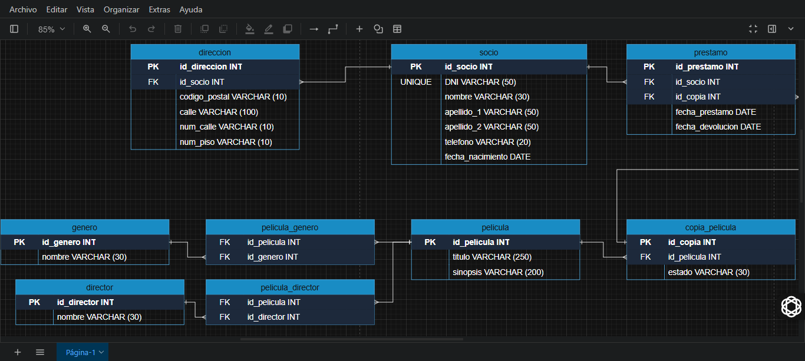

# Datenmodellierung und SQL-Projektlieferung

**KeepCoding Projekte - Web 18**  
Die vollständige Liste der Repositories und Beschreibungen findest du in 📁 [repos-kc-web-18.md](https://github.com/pablo-sch/pablo-sch/blob/main/docs/repos-kc-web-18.md)

## Wähle deine Sprache

- 🇺🇸 [Englisch](README.md)
- 🇪🇸 [Spanisch](README.es.md)

<!-- ------------------------------------------------------------------------------------------- -->

## Projektziel

Dieses Projekt wurde mit dem Zweck erstellt, die in virtuellen Kursen erworbenen Kenntnisse über Datenmodellierung und SQL in einem Fall anzuwenden und zu demonstrieren, der im täglichen Leben relevant ist.

Die Hauptziele sind, eine IT-Lösung durch das Entwerfen einer Datenbank für ein Problem bereitzustellen, das in der realen Welt auftreten kann, und die im Online-Unterricht vermittelten Inhalte effektiv anwenden zu können.

<!-- ------------------------------------------------------------------------------------------- -->

## Erlerntes Wissen und Vorgehensweise

- Verwendung von **Datenbanken**, **Datenmodellierungsdiagrammen** und **SQL**.
- Identifikation von:
  - Entitäten und Beziehungen.
  - Attributen und Typen.
  - Primär- und Fremdschlüsseln.
  - Kardinalität I-II-III.
  - Normalisierung I-II-III-IV-V-VI-VII.
- **Erstellung**, **Änderung**, **Löschung** von Tabellen.
- **Einfügen** und **Extrahieren** von Daten in die bzw. aus den erstellten Tabellen.

<!-- ------------------------------------------------------------------------------------------- -->

## Projektdetails

Es gibt einen Videoverleih, der nicht über die geeignete Software verfügt, um das Geschäft effizient zu verwalten, weshalb wir aufgefordert werden, basierend auf den vom Kunden bereitgestellten Daten eine neue Datenbank zu erstellen.

- Es müssen die **Mitglieder** erfasst werden, die den Videoverleih besuchen. Benötigt werden Vorname, Nachname, Geburtsdatum, Telefonnummer und Identifikationsnummer.
- Es muss die **Postadresse** der Mitglieder erfasst werden. Benötigt werden Postleitzahl, Straße, Hausnummer und Etage. Die Adresse ist **optional** zu erfassen.
- Es müssen **Filme** erfasst werden. Benötigt werden Titel, Genre, Regisseur und Synopsis jedes Films. Zusätzlich kann jeder Film mehr als eine Kopie haben.
- Es muss bekannt sein, welches Mitglied welche Kopie **ausgeliehen** hat und wann; also das Datum der Ausleihe und das Rückgabedatum. Wenn ein Film kein Rückgabedatum hat, gilt er als verliehen.
- Außerdem muss abgefragt werden können, welche Filme derzeit verfügbar sind (diejenigen, die nicht verliehen sind). Es wird der Filmtitel und die Anzahl der verfügbaren Kopien benötigt.

<!-- ------------------------------------------------------------------------------------------- -->

## Verwendete Technologien

- **SQL (PostgreSQL):** Standardisierte Sprache für die Verwaltung und Bearbeitung von relationalen Datenbanken.
- **draw.io:** Visuelle Darstellung der Datenbank.

<!-- ------------------------------------------------------------------------------------------- -->

## Installations- und Gebrauchsanleitung

### Softwareanforderungen

- **[draw.io](https://app.diagrams.net)**
- **[DBeaver](https://dbeaver.io/)** (getestet mit Version **25.0.0.202503021833**)

### Klonen des Repositories

Projekt

```bash
   git clone https://github.com/pablo-sch/keepcoding-03-sql-fundamentals.git
```

Demo


### Öffnen der Dateien

1. Öffnen Sie die Datei "Diagrama Modelado de Datos VideoClub.drawio" über die **draw.io**-Website.

2. Öffnen Sie die Datei "Script SQL VideoClub.sql" über die **DBeaver**-Anwendung in der **PostgreSQL**-Datenbank.

<!-- ------------------------------------------------------------------------------------------- -->

## Projektvorschau

### VideoClub



<!-- ------------------------------------------------------------------------------------------- -->

## Keine Beiträge oder Lizenzen

Dieses Projekt hat keine externen Beiträge oder Lizenzen.
