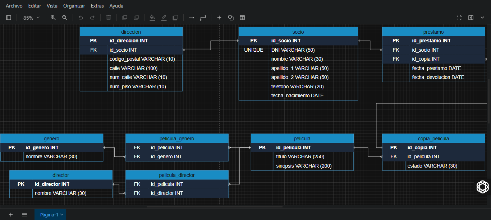

# Entrega Proyecto de Modelado de Datos y SQL

`>` **Proyectos KeepCoding - Web 18:** 📁 [repos-kc-web-18.md](https://github.com/pablo-sch/pablo-sch/blob/main/docs/repos-kc-web-18.md)

`>` **Selecciona tu Idioma:** [Inglés](README.md) 🔄 [Alemán](README.de.md)

<!-- ------------------------------------------------------------------------------------------- -->

## Objetivo del Proyecto

Este proyecto fue creado con el fin de ejercitar y demostrar los conocimientos adquiridos en clases virtuales sobre el Modelado de Datos y SQL ante un caso que se pueda aplicar dentro de la vida cotidiana.

Los principales objetivos son dar una solución informática a través del maquetado de una base de datos ante una problemática que puede ocurrir en la vida real y ser capaces de aplicar los contenidos enseñados en clases online de forma efectiva.

<!-- ------------------------------------------------------------------------------------------- -->

## Conocimientos Aprendidos y Trabajados

- Uso de **Base de Datos**, **Diagramas de Modelado de Datos** y **SQL**.
- Identificación de:
  - Entidades y Relaciones.
  - Atributos y Tipos.
  - Claves Primarias y Foráneas.
    Cardinalidad I-II-III.
  - Normalizacion I-II-III-IV-V-VI-VII.
- **Creación**, **Modificación**, **Borrado** de Tablas.
- **Incercion** y **Extracción** de datos hacia las Tablas Creadas.

<!-- ------------------------------------------------------------------------------------------- -->

## Detalles del Proyecto

Se posee un Video Club que no posee el software adecuado para manejar el negocio de forma eficiente, por lo cual se nos pide confeccionar una nueva base de datos según los datos que nos proporciona el cliente.

- Se necesita registrar los **Socios** que van al Video Club. Se necesita el Nombre, Apellidos, Fecha de Nacimiento, Teléfono y número de Identificación.
- Se necesita registrar la **Dirección de Correspondencia** de los Socios. Se necesita el Código Postal, Calle, Número y Piso. La Dirección es **opcional** registrarlo.
- Se necesita registrar **Películas**. Se necesita el Título, Género, Director y Sinopsis de cada una. Además cada Película puede tener más de una copia.
- Se necesita saber que Socio a **Prestado** cada copia y cuándo, o sea, la fecha en la que se la ha llevado y la fecha de la devolución. Cuando una película no tiene fecha de devolución, se considera prestada.
- Además se necesita consultar qué películas estan disponibles para alquilar en este momento (las que no están prestadas). Se requiere saber el título de la película y el número de copias disponibles.

<!-- ------------------------------------------------------------------------------------------- -->

## Tecnologías Utilizadas

- **SQL (PostgreSQL):** Lenguaje estandarizado para gestionar y manipular bases de datos relacionales.
- **draw.io :** Representación visual de la base de datos.

<!-- ------------------------------------------------------------------------------------------- -->

## Instrucciones de Instalación y Uso

### 1. Requisitos de Software

- **[draw.io](https://app.diagrams.net)**
- **[DBeaver](https://dbeaver.io/)** (testeado en la versión **25.0.0.202503021833**)

### 2. Clonación del Repositorio

```bash
   git clone https://github.com/pablo-sch/keepcoding-03-sql-fundamentals.git
```

`>` **Ver Demo de Clonanción en VSCode:** 🎥 [Gif Demo](https://github.com/pablo-sch/pablo-sch/blob/main/etc/clone-tutorial.gif)

### 3. Abrir Archivos

1. Abra el archivo "Diagrama Modelado de Datos VideoClub.drawio" a través de la página **draw.io**.

2. Abra el archivo "Script SQL VideoClub.sql" a través de la aplicación **DBeaver** mediante la base de datos **PostgreSQL**.

<!-- ------------------------------------------------------------------------------------------- -->

## Recursos del Proyecto

### Vista Previa del Proyecto

#### VideoClub



<!-- ------------------------------------------------------------------------------------------- -->

## Contribuciones y Licencias

Proyecto bajo licencia MIT. Uso y distribución libres con atribución. No se aceptan contribuciones externas, pero las sugerencias son bienvenidas.
